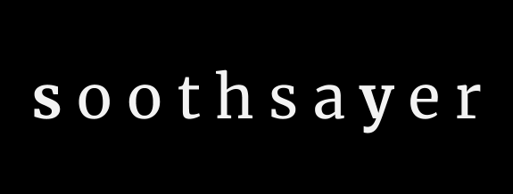

## Warnings: 
If you have Apple Silicon, you'll have to set the following config: 
```
conda config --env --set subdir osx-64
```
## Installation instructions:
There are several Python & R dependencies that are difficult to install so the recommended installation method is via `conda` with the preconfigured environment `.yml` files.  

Use `conda` to create the environment with all dependencies then `pip install --no-deps soothsayer` to install `soothsayer`.  Once the API of `soothsayer` is stable it will be properly added to `anaconda cloud`.

### Method 1 :
#### [OSX|Linux] Installation [Recommended]
Inspired by [qiime2](https://docs.qiime2.org/2019.4/install/native/) installation method.  Please use the most updated environment and then install the current developmental branch (described under `Update to the current release`).

```bash
# Download the conda environment instructions
wget https://raw.githubusercontent.com/jolespin/soothsayer/master/install/soothsayer_py39_v2021.01.13.osx.yml
# Create a new environment (you should probably do this from the base environment [conda activate base])
conda env create -y --name soothsayer_env --file soothsayer_py39_v2021.01.13.osx.yml
# [Optional] Remove the environment file
rm soothsayer_py39_v2021.01.13.osx.yml
# Activate environment
conda activate soothsayer_env

# For Linux, replace the `osx` with `linux`.  Though, not all versions have been precompiled. 

```

### Method 2:
#### OSX | Linux | (Windows?) Installation
```bash
wget https://raw.githubusercontent.com/jolespin/soothsayer/master/install/base_installation.sh
# bash base_installation.sh  <env_name> <py_version>
bash base_installation.sh 
# or
bash base_installation.sh soothsayer_env
# or
bash base_installation.sh soothsayer_env 3.9
# Duration: This will take a while and may require manually installing a few packages if certain ones fail.  This is mostly a base to see what needs to be installed and it will likely fail. As mentioned, I'm working endlessly to reduce the dependencies.
```

#### Update to the current release [Recommended]
Since `soothsayer` is still in a developmental stage, I'm constantly adding methods, fixing bugs, and moving code around.  Note please read critical bug in subsequent section.  

```bash
# First time installing
pip install --no-deps git+https://github.com/jolespin/soothsayer

# Updating
bash remove_and_reinstall_soothsayer.sh

```

#### Critical bug with `pip install soothsayer`
There is a strange [issue](https://github.com/pypa/pip/issues/7170) that I'm working on with `PyPI`  where installing `soothsayer` via `pip` *sometimes* removes all of the packages in `site-directory`.  I've found a work around for the time being.  Please use the `remove_and_reinstall_soothsayer.sh` script to first remove an older instance of `soothsayer` and reinstall the newest version. To be as safe as possible, you can manually delete `soothsayer` from `site-packages` and then reinstall with `pip` using `--no-deps`.  Basically, this won't be an issue if this is your first time installing but if you are updating, I highly recommend manually removing from site-packages and then installing with `--no-deps` flag. 

Let me know if you have any issues before creating an issue on GitHub:
jespinoz[ a t ]jcvi[ d o t ]org


